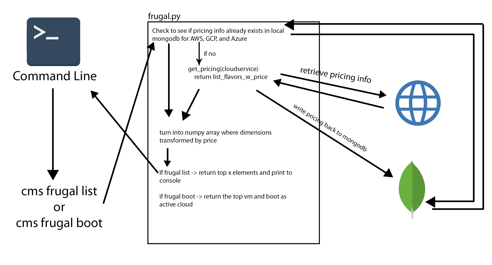

# Cloudmesh Frugal

Brian Funk

brfunk@iu.edu

[fa19-516-166](https://github.com/cloudmesh-community/fa19-516-166)

[Contributors](https://github.com/cloudmesh-community/fa19-516-166/graphs/contributors)

[Insights](https://github.com/cloudmesh-community/fa19-516-166/pulse)

### Code Repository

[CODE REPOSITORY](https://github.com/cloudmesh/cloudmesh-frugal)

## Usage

        """
        ::

            Usage:
                frugal list [--benchmark] [--refresh] [--order=ORDER] [--size=SIZE] [--cloud=CLOUD]
                frugal boot [--refresh] [--order=ORDER] [--cloud=CLOUD]
                frugal benchmark

            Arguments:
              ORDER       sorting hierarchy, either price, cores, or
                          memory. DEFAULT = price
              SIZE        number of results to be printed to the
                          console. DEFAULT = 25, and can be changed with
                          cms set frugal.size = SIZE
              CLOUD       Limits the frugal method to a specific cloud
                          instead of all supported providers

            Options:
               --refresh         forces a refresh on all entries for
                                 all supported providers
               --order=ORDER     sets the sorting on the results list
               --size=SIZE       sets the number of results returned
                                 to the console
               --benchmark       prints the benchmark results instead
                                 of flavors

            Description:
                frugal list
                    lists cheapest flavors for aws, azure, and gcp
                    in a sorted table by default, if --benchmark is
                    used then it lists benchmark results stored in
                    the db

                frugal boot
                    boots the cheapest bootable vm from the frugal
                    list.

                frugal benchmark
                    executes a benchmarking command on the newest
                    available vm on the current cloud

            Examples:


                 cms frugal list --refresh --order=price --size=150
                 cms frugal list --benchmark
                 cms frugal boot --order=memory
                 cms frugal benchmark

                 ...and so on

            Tips:
                frugal benchmark will stall the command line after
                the user enters their ssh key. This means the benchmark
                is running

                frugal benchmark is dependent on the vm put command.
                this may need to be manually added to the vm command
                file.


            Limitations:

                frugal boot and benchmark only work on implemented providers


        """
        
## Notes

### Installation

Cloudmesh frugal can be installed with cloudmesh and the following commands

```
source ~/ENV3/bin/activate
mkdir cm
cd cm
pip install cloudmesh-installer
cloudmesh-installer git clone cloud
cloudmesh-installer install cloud
git clone https://github.com/cloudmesh/cloudmesh-frugal
cd cloudmesh-frugal
pip install -e .
```

### vm put Command

Frugal benchmark is dependent on the vm put command, which needs to be appended to cloud/cloudmesh/vm/command/vm.py. The method is:
```
       elif arguments.put:
            """
            vm put SOURCE DESTINATION
            """
            clouds, names, command = Arguments.get_commands("ssh",
                                                            arguments,
                                                            variables)

            key = variables['key']

            source = arguments['SOURCE']
            destination = arguments['DESTINATION']
            for cloud in clouds:
                #p = Provider(cloud)
                cm = CmDatabase()
                for name in names:
                    try:
                        vms = cm.find_name(name, "vm")
                    except IndexError:
                        Console.error(f"could not find vm {name}")
                        return ""
                    # VERBOSE(vm)
                    for vm in vms:
                        ip = vm['public_ips']

                        #get the username
                        try:
                            user = vm['username']
                        except:
                            #username not in vm...guessing
                            imagename = list(cm.collection(cloud+'-image').find({'ImageId' : vm['ImageId']}))[0]['name']
                            user = Image.guess_username(image=imagename,cloud=cloud)
                        cmd = f'scp -i {key} {source} {user}@{ip}:{destination}'
                        print(cmd)
                        os.system(cmd)
            return ""
```

## Abstract

Cloudmesh frugal is a cloudmesh commandline API for comparing the cost of compute for supported compute providers in various regions.
It compares price relative to the hardware specifications of the machines, an provide the VM with the best value. It has three core
commands which list, boot, and benchmark the cheapest vm. The current support providers are AWS, and Azure with full support, and GCP 
with list support only. 


## Introduction

Cloudmesh frugal collects pricing information on all of the availble flavors for AWS, GCP, and Azure. Those prices are then
compared to the physical specifications of the machine, which are then compared with each other. The core component of frugal is a
ranked list of flavors across the three compute providers, sorted by value. From this list, vms can be booted, and then benchmarked. 


## Design

Calling the cloudmesh frugal list command will first check to see if frugal information already exists in the local mongodb. If it is
does and the user does not signal for a refresh, then the local information is used. If the information does not exist for a provider
or the user signals for a refresh, then the flavor pricing information is pulled and processed into a frugal matrix. The frugal
is then saved back to the local mongodb, and then combined with the information of the other providers. It is then sorted, and the 
final frugal matrix is printed to the console. Calling frugal boot retrieves final table produces in frugal list, but does not
print it. Instead it filters the table to the providers that are usuable, and then boots the top ranked vm. Finally frugal benchmark
is designed to be used directly after frugal boot, as it uses the current cloud and the most recent vm. It sends a benchmarking file
to the vm via scp, runs the benchmark, prints the benchmark times, and then deletes the file.

### Architecture

This is a sketch of the logic flow of cloudmesh frugal list and boot. It is not comprehensive, but it gives a core understanding
of how the command works and interacts with the local db and the internet.
{#fig:frugal_design}


## Benchmarks

There are two pytest files for frugal, test_01_frugal_list.py and test_02_frugal_boot.py. They collectively test frugal list, boot,
and benchmark.

## References

[Cloudmesh Manual](https://cloudmesh.github.io/cloudmesh-manual/index.html)

[Python for Cloud Computing](https://laszewski.github.io/book/python/)

[Cloud Computing](https://laszewski.github.io/book/cloud/)
